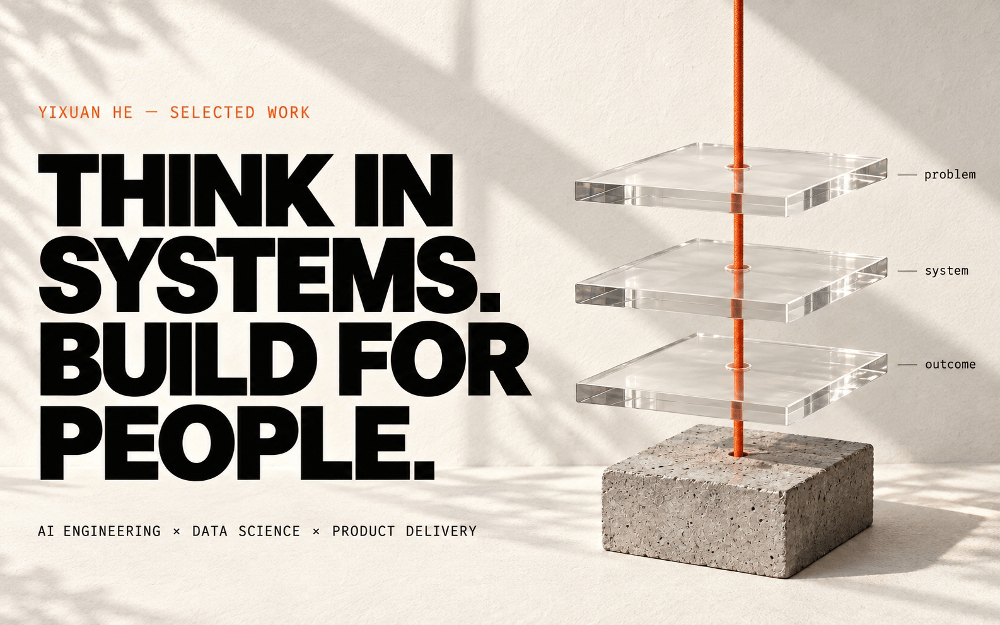

<picture>
  <source media="(prefers-reduced-motion: reduce) and (prefers-color-scheme: dark)" srcset="./assets/field-notes-hero-dark.jpg">
  <source media="(prefers-reduced-motion: reduce)" srcset="./assets/field-notes-hero-light.jpg">
  <source media="(prefers-color-scheme: dark)" srcset="./assets/field-notes-hero-dark.gif">
  <source media="(prefers-color-scheme: light)" srcset="./assets/field-notes-hero-light.gif">
  
</picture>

Still editions: <a href="./assets/field-notes-hero-light.jpg">light</a> / <a href="./assets/field-notes-hero-dark.jpg">dark</a>.

## From idea to MVP. Built for enterprise realities.

I turn ambiguous business ideas into **working AI products** — connecting the problem, the people, and the engineering needed to make them useful.

A **forward-deployed mindset**: get close to the work, build the first useful version quickly, and keep going beyond the demo. Fast to first value; thoughtful about reliability, access, and the human workflow.

[View portfolio ↗](https://www.yixuanhe.com) &nbsp; / &nbsp; [Explore the builds ↓](#selected-public-builds) &nbsp; / &nbsp; [LinkedIn ↗](https://www.linkedin.com/in/yixuanhe2/)

Two editions, one profile. Artwork follows your GitHub light or dark theme. <a href="https://github.com/settings/appearance">Change appearance ↗</a>

<picture>
  <source media="(prefers-reduced-motion: reduce) and (prefers-color-scheme: dark)" srcset="./assets/profile-motion-dark-static.png">
  <source media="(prefers-reduced-motion: reduce)" srcset="./assets/profile-motion-light-static.png">
  <source media="(prefers-color-scheme: dark)" srcset="./assets/profile-motion-dark.gif">
  <source media="(prefers-color-scheme: light)" srcset="./assets/profile-motion-light.gif">
  
</picture>

Prefer stillness? <a href="./assets/profile-motion-light-static.png">Static light</a> / <a href="./assets/profile-motion-dark-static.png">static dark</a>.

## Enterprise AI, built end to end.

**Private work. Real business problems. Full-stack ownership.**

At Mercedes-Benz, I'm the sole developer of an internal enterprise platform focused on **AI transformation**: turning business-process ideas into concrete, actionable solution plans. I own the engineering end to end; the ideas and business context are shaped with the team.

The interesting part is the translation — from “could AI help here?” to a clear problem, a working MVP, and a practical path to implementation.

<strong>What I bring — from the first conversation to a usable system</strong>

- **Problem framing.** Work with business teams to find the decision, bottleneck, and user need beneath the initial request.
- **Rapid delivery.** Make the idea tangible early, then iterate on a real workflow rather than a slide deck.
- **End-to-end engineering.** Connect the AI layer, application, data, and delivery into one coherent product.
- **Enterprise judgment.** Treat reliability, access, traceability, and human review as design constraints, not afterthoughts.

The implementation stays private. No internal screenshots, system details, or company data are published here.

## Selected public builds

Different domains. The same habit: connect intelligence to something people can actually use.

<table>
  <tr>
    <td width="50%" valign="top">
      <a href="https://github.com/heyixuan2/bambu-studio-ai">
        <picture>
          <source media="(prefers-color-scheme: dark)" srcset="./assets/field-notes-print-dark.jpg">
          <source media="(prefers-color-scheme: light)" srcset="./assets/field-notes-print-light.jpg">
          
        </picture>
      </a>
      <h3><a href="https://github.com/heyixuan2/bambu-studio-ai">bambu-studio-ai</a></h3>
      
An end-to-end AI workflow for Bambu Lab 3D printers.

      

        
<strong>Read the engineering notes</strong>

        
<strong>From an idea to a physical object.</strong> Search, generate, analyze, repair, preview, print, and monitor from one workflow.

        
Bringing the reasoning layer and the physical toolchain into one usable system.

        
<a href="https://github.com/heyixuan2/bambu-studio-ai#readme">Explore the project →</a>

      

    </td>
    <td width="50%" valign="top">
      <a href="https://github.com/heyixuan2/ashare-neural-network">
        <picture>
          <source media="(prefers-color-scheme: dark)" srcset="./assets/field-notes-signal-dark.jpg">
          <source media="(prefers-color-scheme: light)" srcset="./assets/field-notes-signal-light.jpg">
          
        </picture>
      </a>
      <h3><a href="https://github.com/heyixuan2/ashare-neural-network">ashare-neural-<wbr>network</a></h3>
      
Hybrid LSTM–Transformer research for A-share forecasting.

      

        
<strong>Read the engineering notes</strong>

        
<strong>Finding signal in financial time series.</strong> A hybrid architecture with 49-dimensional features, temporal splitting, and ensemble training.

        
A modeling and evaluation project, not a claim of investment performance.

        
<a href="https://github.com/heyixuan2/ashare-neural-network#readme">Explore the project →</a>

      

    </td>
  </tr>
</table>

**Mercedes-Benz · Georgetown DSAN · Cornell M.Eng.** 
Systems thinking, from the model to the last mile.

<strong>About the builder — background & real-world impact</strong>

- Building enterprise AI solutions at **Mercedes-Benz**.
- M.S. candidate in **Data Science & Analytics (AI)** at Georgetown University.
- M.Eng. in **Systems Engineering** from Cornell University.
- Native/bilingual in **Mandarin and English**.

### Beyond the demo

- Designed an enterprise AI application that diagnoses business processes and generates AI-native redesign roadmaps using an original automation-potential scoring framework.
- Re-engineered an LLM resume-screening prototype into a standalone, Dockerized application that cleared enterprise IT review for pilot testing.
- Built executive and operational Power BI systems across Mercedes-Benz China and led a data enablement program for **140+ employees**, driving **80%+ adoption**.

<strong>How I work — four operating principles</strong>

1. **Start with the decision, not the model.** Technology matters only when it changes an outcome.
2. **Design the whole system.** Data, interfaces, deployment, users, and incentives belong in the same architecture.
3. **Ship usable artifacts.** A working product beats an impressive prototype that never leaves the demo.
4. **Make complexity legible.** Good systems help technical and business teams reason together.

<strong>Open the toolbox — what I build with</strong>

| Discipline | Tools & approaches |
| :--- | :--- |
| AI systems | LLM workflows · RAG · AI agents · Dify · Transformers · Deep learning |
| Engineering | Python · R · SQL · PostgreSQL · MongoDB · Data modeling |
| Delivery | Docker · AWS EC2 · Vercel · Cloudflare · Tencent Cloud · Tailscale |
| Decisions | Power BI · Tableau · Excel · Experimentation · Executive analytics |
| Automation | Power Apps · Power Automate · Microsoft 365 |
| Design | Figma · Photoshop · Illustrator · Premiere Pro · Final Cut Pro |

## Building, one day at a time.

<!-- generated from the unauthenticated public calendar; never from private repository details -->
<picture>
  <source media="(prefers-reduced-motion: reduce) and (prefers-color-scheme: dark) and (max-width: 1100px)" srcset="./assets/contributions-dark-mobile-static.svg">
  <source media="(prefers-reduced-motion: reduce) and (max-width: 1100px)" srcset="./assets/contributions-light-mobile-static.svg">
  <source media="(prefers-reduced-motion: reduce) and (prefers-color-scheme: dark)" srcset="./assets/contributions-dark-static.svg">
  <source media="(prefers-reduced-motion: reduce)" srcset="./assets/contributions-light-static.svg">
  <source media="(prefers-color-scheme: dark) and (max-width: 1100px)" srcset="./assets/contributions-dark-mobile.svg">
  <source media="(max-width: 1100px)" srcset="./assets/contributions-light-mobile.svg">
  <source media="(prefers-color-scheme: dark)" srcset="./assets/contributions-dark.svg">
  
</picture>

Our own view of the <a href="https://github.com/heyixuan2?tab=overview">public GitHub calendar</a>. Daily squares, weekly totals, no invented activity. Contribution counts are not a measure of impact. <a href="./assets/contributions-light-static.svg">Static light</a> / <a href="./assets/contributions-dark-static.svg">Static dark</a>.

 

<picture>
  <source media="(prefers-color-scheme: dark)" srcset="./assets/field-notes-footer-dark.jpg">
  <source media="(prefers-color-scheme: light)" srcset="./assets/field-notes-footer-light.jpg">
  
</picture>

<a href="https://www.yixuanhe.com">More of my work</a> &nbsp; / &nbsp; <a href="https://www.linkedin.com/in/yixuanhe2/">Start a conversation</a>

