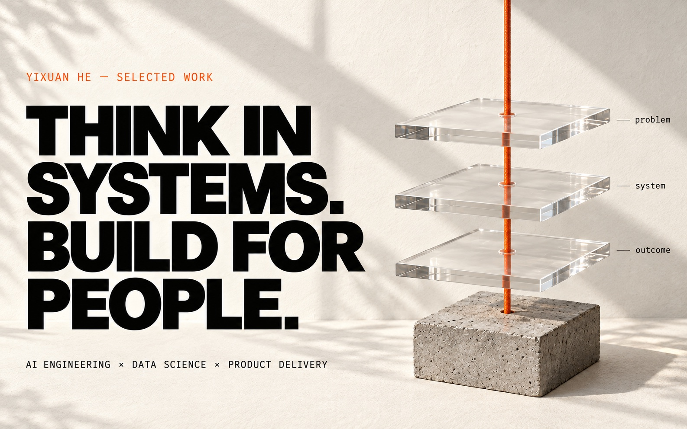

<picture>
  <source media="(prefers-color-scheme: dark)" srcset="./assets/field-notes-hero-dark.jpg">
  <source media="(prefers-color-scheme: light)" srcset="./assets/field-notes-hero-light.jpg">
  
</picture>

## I turn business problems into useful, working AI systems.

I design, build, and ship at the intersection of **LLM systems, data science, enterprise automation, and business impact**.

[View portfolio ↗](https://www.yixuanhe.com) &nbsp; / &nbsp; [Explore the builds ↓](#two-ways-i-build) &nbsp; / &nbsp; [LinkedIn ↗](https://www.linkedin.com/in/yixuanhe2/)

Two editions, one profile. Artwork follows your GitHub light or dark theme. <a href="https://github.com/settings/appearance">Change appearance ↗</a>

## Two ways I build

<table>
  <tr>
    <td width="50%" valign="top">
      <a href="https://github.com/heyixuan2/bambu-studio-ai">
        <picture>
          <source media="(prefers-color-scheme: dark)" srcset="./assets/field-notes-print-dark.jpg">
          <source media="(prefers-color-scheme: light)" srcset="./assets/field-notes-print-light.jpg">
          
        </picture>
      </a>
      <h3><a href="https://github.com/heyixuan2/bambu-studio-ai">bambu-studio-ai</a></h3>
      
An end-to-end AI workflow for Bambu Lab 3D printers.

      

        
<strong>Read the engineering notes</strong>

        
<strong>From an idea to a physical object.</strong> Search, generate, analyze, repair, preview, print, and monitor from one workflow.

        
Bringing the reasoning layer and the physical toolchain into one usable system.

        
<a href="https://github.com/heyixuan2/bambu-studio-ai#readme">Explore the project →</a>

      

    </td>
    <td width="50%" valign="top">
      <a href="https://github.com/heyixuan2/ashare-neural-network">
        <picture>
          <source media="(prefers-color-scheme: dark)" srcset="./assets/field-notes-signal-dark.jpg">
          <source media="(prefers-color-scheme: light)" srcset="./assets/field-notes-signal-light.jpg">
          
        </picture>
      </a>
      <h3><a href="https://github.com/heyixuan2/ashare-neural-network">ashare-neural-<wbr>network</a></h3>
      
Hybrid LSTM–Transformer research for A-share forecasting.

      

        
<strong>Read the engineering notes</strong>

        
<strong>Finding signal in financial time series.</strong> A hybrid architecture with 49-dimensional features, temporal splitting, and ensemble training.

        
A modeling and evaluation project, not a claim of investment performance.

        
<a href="https://github.com/heyixuan2/ashare-neural-network#readme">Explore the project →</a>

      

    </td>
  </tr>
</table>

**Mercedes-Benz · Georgetown DSAN · Cornell M.Eng.** 
Systems thinking, from the model to the last mile.

<strong>About the builder — background & real-world impact</strong>

- Building enterprise AI solutions at **Mercedes-Benz**.
- M.S. candidate in **Data Science & Analytics (AI)** at Georgetown University.
- M.Eng. in **Systems Engineering** from Cornell University.
- Native/bilingual in **Mandarin and English**.

### Beyond the demo

- Designed an enterprise AI application that diagnoses business processes and generates AI-native redesign roadmaps using an original automation-potential scoring framework.
- Re-engineered an LLM resume-screening prototype into a standalone, Dockerized application that cleared enterprise IT review for pilot testing.
- Built executive and operational Power BI systems across Mercedes-Benz China and led a data enablement program for **140+ employees**, driving **80%+ adoption**.

<strong>How I work — four operating principles</strong>

1. **Start with the decision, not the model.** Technology matters only when it changes an outcome.
2. **Design the whole system.** Data, interfaces, deployment, users, and incentives belong in the same architecture.
3. **Ship usable artifacts.** A working product beats an impressive prototype that never leaves the demo.
4. **Make complexity legible.** Good systems help technical and business teams reason together.

<strong>Open the toolbox — what I build with</strong>

| Discipline | Tools & approaches |
| :--- | :--- |
| AI systems | LLM workflows · RAG · AI agents · Dify · Transformers · Deep learning |
| Engineering | Python · R · SQL · PostgreSQL · MongoDB · Data modeling |
| Delivery | Docker · AWS EC2 · Vercel · Cloudflare · Tencent Cloud · Tailscale |
| Decisions | Power BI · Tableau · Excel · Experimentation · Executive analytics |
| Automation | Power Apps · Power Automate · Microsoft 365 |
| Design | Figma · Photoshop · Illustrator · Premiere Pro · Final Cut Pro |

<strong>A small moving detail — contribution trail</strong>

<picture>
  <source media="(prefers-color-scheme: dark)" srcset="https://raw.githubusercontent.com/heyixuan2/heyixuan2/output/github-contribution-grid-snake-dark.svg">
  <source media="(prefers-color-scheme: light)" srcset="https://raw.githubusercontent.com/heyixuan2/heyixuan2/output/github-contribution-grid-snake.svg">
  
</picture>

A playful view of contribution activity, not a productivity score. The animation stays tucked away until you open it.

 

<picture>
  <source media="(prefers-color-scheme: dark)" srcset="./assets/field-notes-footer-dark.jpg">
  <source media="(prefers-color-scheme: light)" srcset="./assets/field-notes-footer-light.jpg">
  
</picture>

<a href="https://www.yixuanhe.com">More of my work</a> &nbsp; / &nbsp; <a href="https://www.linkedin.com/in/yixuanhe2/">Start a conversation</a>

