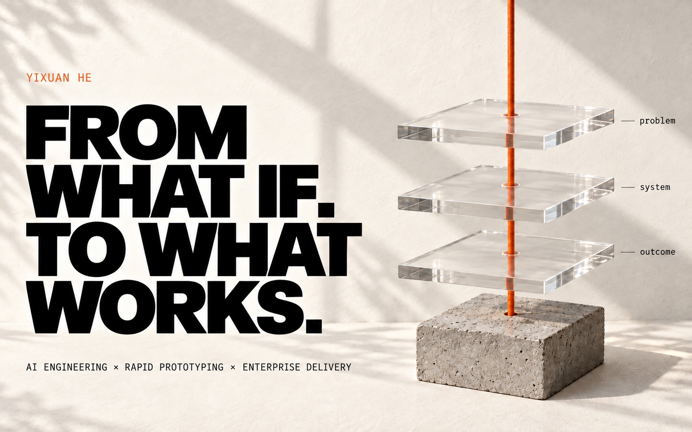
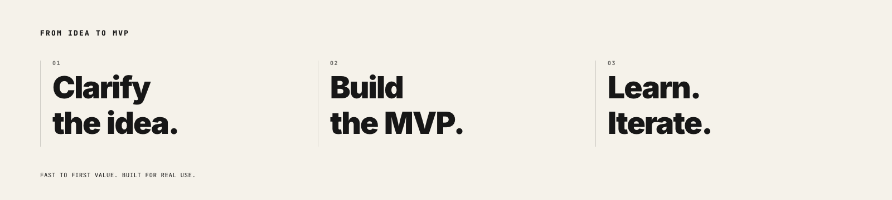
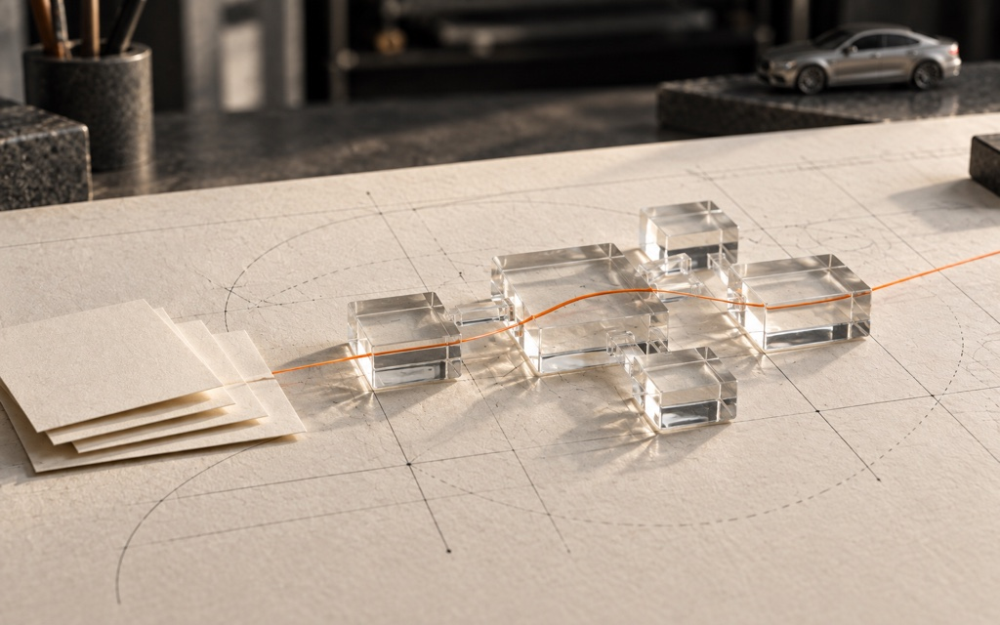
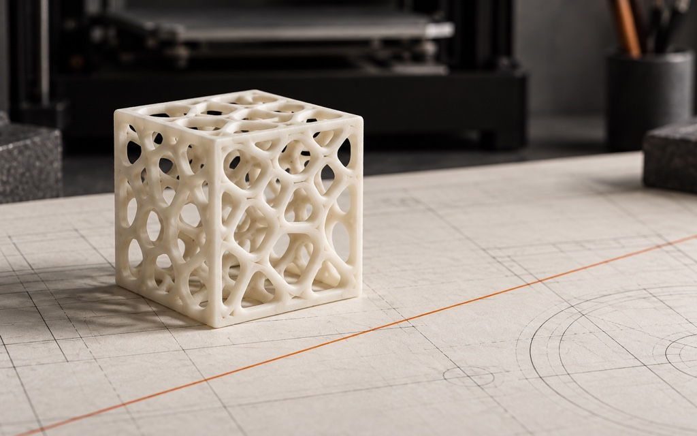
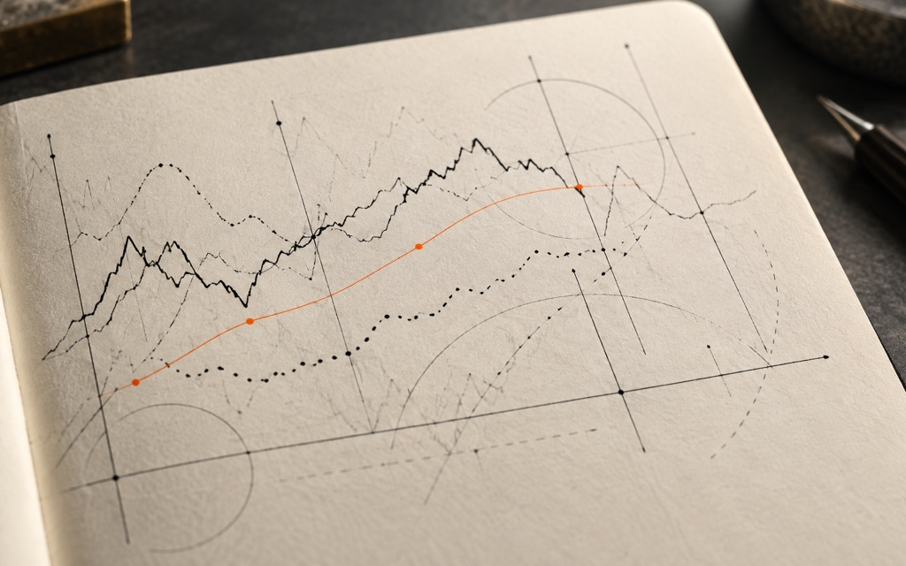

<picture>
  <source media="(prefers-color-scheme: dark)" srcset="./assets/field-notes-hero-dark-v2.jpg">
  <source media="(prefers-color-scheme: light)" srcset="./assets/field-notes-hero-light-v2.jpg">
  
</picture>

## Built for Enterprise Realities.

I build **AI products inside large organizations**, where the model is rarely the hard part.

What decides the outcome is the gap between a working demo and a system people depend on. **Forward-deployed** work means owning that gap — and it's the work I'm looking for.

  <a href="https://www.yixuanhe.com"><picture><source media="(prefers-color-scheme: dark) and (max-width: 700px)" srcset="./assets/ui/nav-portfolio-dark-mobile.svg"><source media="(max-width: 700px)" srcset="./assets/ui/nav-portfolio-light-mobile.svg"><source media="(prefers-color-scheme: dark)" srcset="./assets/ui/nav-portfolio-dark.svg"></picture></a><!--
  --><a href="#for-the-fun-of-it"><picture><source media="(prefers-color-scheme: dark) and (max-width: 700px)" srcset="./assets/ui/nav-builds-dark-mobile.svg"><source media="(max-width: 700px)" srcset="./assets/ui/nav-builds-light-mobile.svg"><source media="(prefers-color-scheme: dark)" srcset="./assets/ui/nav-builds-dark.svg"></picture></a><!--
  --><a href="https://www.linkedin.com/in/yixuanhe2/"><picture><source media="(prefers-color-scheme: dark) and (max-width: 700px)" srcset="./assets/ui/nav-linkedin-dark-mobile.svg"><source media="(max-width: 700px)" srcset="./assets/ui/nav-linkedin-light-mobile.svg"><source media="(prefers-color-scheme: dark)" srcset="./assets/ui/nav-linkedin-dark.svg"></picture></a>

<picture>
  <source media="(prefers-reduced-motion: reduce) and (prefers-color-scheme: dark)" srcset="./assets/profile-motion-dark-static.png">
  <source media="(prefers-reduced-motion: reduce)" srcset="./assets/profile-motion-light-static.png">
  <source media="(prefers-color-scheme: dark)" srcset="./assets/profile-motion-dark.gif">
  <source media="(prefers-color-scheme: light)" srcset="./assets/profile-motion-light.gif">
  
</picture>

## Featured Projects.

Enterprise applications I built at Mercedes-Benz as the primary developer. The business context and requirements are shaped with the team. These systems run internally, so only the concept is shared here — not the code, screenshots, or data.

<table>
  <tr>
    <td width="50%" valign="top">
      <picture>
        <source media="(prefers-color-scheme: dark)" srcset="./assets/field-notes-mbods-dark.jpg">
        <source media="(prefers-color-scheme: light)" srcset="./assets/field-notes-mbods-light.jpg">
        
      </picture>
      <h3><picture><source media="(prefers-color-scheme: dark) and (max-width: 700px)" srcset="./assets/ui/org-diagnosis-dark-mobile.svg"><source media="(max-width: 700px)" srcset="./assets/ui/org-diagnosis-light-mobile.svg"><source media="(prefers-color-scheme: dark)" srcset="./assets/ui/org-diagnosis-dark.svg"></picture></h3>
      
An enterprise AI transformation platform for any process, in any function.

      
<strong>From Unstructured Documents to Organizational Change.</strong> Parses source documents into a verified BPMN map, designs the AI-native future state, and issues the implementation plan and workforce impact.

      
Every score and FTE figure carries its source, method, and approver. A live pilot with its first users, now being engineered toward production.

    </td>
    <td width="50%" valign="top">
      <picture>
        <source media="(prefers-color-scheme: dark)" srcset="./assets/field-notes-talent-dark.jpg">
        <source media="(prefers-color-scheme: light)" srcset="./assets/field-notes-talent-light.jpg">
        
      </picture>
      <h3><picture><source media="(prefers-color-scheme: dark) and (max-width: 700px)" srcset="./assets/ui/talent-platform-dark-mobile.svg"><source media="(max-width: 700px)" srcset="./assets/ui/talent-platform-light-mobile.svg"><source media="(prefers-color-scheme: dark)" srcset="./assets/ui/talent-platform-dark.svg"></picture></h3>
      
A full-lifecycle talent acquisition platform.

      
<strong>Tracked and Supported at Every Stage.</strong> Consolidates job descriptions, resumes, interview materials, and transcripts into a single candidate record: competency models, candidate comparison, generated interview questions, AI interviews, and AI-assisted scoring.

      
On the roadmap: an AI recruiter that sources candidates rather than waiting for applications. It supports the hiring decision; it does not make it.

    </td>
  </tr>
</table>

## For the Fun of It.

Curiosity projects, taken further than they needed to go. One ends in a physical object, the other in a probability — neither stopped at the notebook.

<table>
  <tr>
    <td width="50%" valign="top">
      <a href="https://github.com/heyixuan2/bambu-studio-ai">
        <picture>
          <source media="(prefers-color-scheme: dark)" srcset="./assets/field-notes-print-dark.jpg">
          <source media="(prefers-color-scheme: light)" srcset="./assets/field-notes-print-light.jpg">
          
        </picture>
      </a>
      <h3><a href="https://github.com/heyixuan2/bambu-studio-ai"><picture><source media="(prefers-color-scheme: dark) and (max-width: 700px)" srcset="./assets/ui/bambu-dark-mobile.svg"><source media="(max-width: 700px)" srcset="./assets/ui/bambu-light-mobile.svg"><source media="(prefers-color-scheme: dark)" srcset="./assets/ui/bambu-dark.svg"></picture></a></h3>
      
An end-to-end AI workflow for Bambu Lab 3D printers.

      
<strong>From an Idea to a Physical Object.</strong> Search, generate, analyze, repair, and preview in one workflow. Review and start the print in Bambu Studio; the agent monitors it read-only.

      
Bringing the reasoning layer and the physical toolchain into one usable system.

    </td>
    <td width="50%" valign="top">
      <a href="https://github.com/heyixuan2/ashare-neural-network">
        <picture>
          <source media="(prefers-color-scheme: dark)" srcset="./assets/field-notes-signal-dark.jpg">
          <source media="(prefers-color-scheme: light)" srcset="./assets/field-notes-signal-light.jpg">
          
        </picture>
      </a>
      <h3><a href="https://github.com/heyixuan2/ashare-neural-network"><picture><source media="(prefers-color-scheme: dark) and (max-width: 700px)" srcset="./assets/ui/ashare-dark-mobile.svg"><source media="(max-width: 700px)" srcset="./assets/ui/ashare-light-mobile.svg"><source media="(prefers-color-scheme: dark)" srcset="./assets/ui/ashare-dark.svg"></picture></a></h3>
      
Hybrid LSTM–Transformer research for A-share forecasting.

      
<strong>Finding Signal in Financial Time Series.</strong> A hybrid architecture with 49-dimensional features, temporal splitting, and ensemble training.

      
A modeling and evaluation project, not a claim of investment performance.

    </td>
  </tr>
</table>

**Mercedes-Benz · Georgetown DSAN · Cornell M.Eng.** 
Systems thinking, from the model to the last mile.

## What I Build With

| Discipline | Tools & Approaches |
| :--- | :--- |
| **AI Systems** | LLM workflows · RAG · AI agents · Dify · Transformers · Deep learning |
| **AI-Assisted Development** | Claude Code · Cursor · Agentic development |
| **Engineering** | Python · R · SQL · PostgreSQL · MongoDB · Data modeling |
| **Delivery** | Docker · AWS EC2 · Vercel · Cloudflare · Tencent Cloud · Tailscale |

## Building, One Day at a Time.

<!-- generated from the unauthenticated public calendar; never from private repository details -->
<picture>
  <source media="(prefers-reduced-motion: reduce) and (prefers-color-scheme: dark) and (max-width: 1100px) and (orientation: portrait)" srcset="./assets/contributions-dark-mobile-static.svg">
  <source media="(prefers-reduced-motion: reduce) and (max-width: 1100px) and (orientation: portrait)" srcset="./assets/contributions-light-mobile-static.svg">
  <source media="(prefers-reduced-motion: reduce) and (prefers-color-scheme: dark)" srcset="./assets/contributions-dark-static.svg">
  <source media="(prefers-reduced-motion: reduce)" srcset="./assets/contributions-light-static.svg">
  <source media="(prefers-color-scheme: dark) and (max-width: 1100px) and (orientation: portrait)" srcset="./assets/contributions-dark-mobile.svg">
  <source media="(max-width: 1100px) and (orientation: portrait)" srcset="./assets/contributions-light-mobile.svg">
  <source media="(prefers-color-scheme: dark)" srcset="./assets/contributions-dark.svg">
  
</picture>

 

## Let's Talk

I'm always glad to talk about forward-deployed work.

**[heyixuan001204@gmail.com](mailto:heyixuan001204@gmail.com)** · **[LinkedIn](https://www.linkedin.com/in/yixuanhe2/)** · **[Résumé](https://www.yixuanhe.com/assets/Yixuan_He_Resume.pdf)** · **[Portfolio](https://www.yixuanhe.com)**

<picture>
  <source media="(prefers-color-scheme: dark)" srcset="./assets/field-notes-footer-dark.jpg">
  <source media="(prefers-color-scheme: light)" srcset="./assets/field-notes-footer-light.jpg">
  
</picture>
