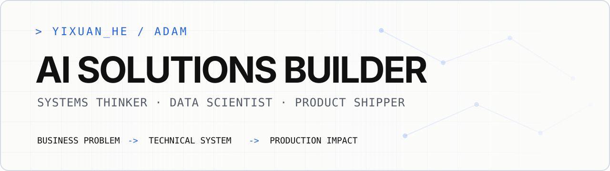

<picture>
  <source media="(prefers-color-scheme: dark)" srcset="./assets/profile-banner-dark.svg">
  <source media="(prefers-color-scheme: light)" srcset="./assets/profile-banner-light.svg">
  
</picture>

<picture>
  <source media="(prefers-color-scheme: dark)" srcset="./assets/animated-tagline-dark.svg">
  <source media="(prefers-color-scheme: light)" srcset="./assets/animated-tagline-light.svg">
  
</picture>

<p align="center">
  <a href="https://www.yixuanhe.com"></a>
  <a href="https://www.linkedin.com/in/yixuanhe2/"></a>
  <a href="https://github.com/heyixuan2/bambu-studio-ai"></a>
</p>

## `$ whoami`

I build AI solutions from **business problem to production** - diagnosing the need, designing the system, and shipping the result. My work sits at the intersection of LLM systems, data science, enterprise automation, and business impact.

- Building enterprise AI solutions at **Mercedes-Benz**
- M.S. candidate in **Data Science & Analytics (AI)** at Georgetown University
- M.Eng. in **Systems Engineering** from Cornell University
- Native/bilingual in **Mandarin and English**

## `$ ls featured-builds/`

<table>
  <tr>
    <td width="50%" valign="top">
      <h3><a href="https://github.com/heyixuan2/bambu-studio-ai">bambu-studio-ai</a></h3>
      <p>An end-to-end AI agent skill for Bambu Lab 3D printers: search, generate, analyze, repair, preview, print, and monitor from one workflow.</p>
      <p>
        
        
        
      </p>
    </td>
    <td width="50%" valign="top">
      <h3><a href="https://github.com/heyixuan2/ashare-neural-network">ashare-neural-network</a></h3>
      <p>An A-share forecasting system using a hybrid LSTM-Transformer architecture, 49-dimensional features, temporal splitting, and ensemble training.</p>
      <p>
        
        
      </p>
    </td>
  </tr>
</table>

## `$ cat impact.log`

- Designed an enterprise AI application that diagnoses business processes and generates AI-native redesign roadmaps using an original automation-potential scoring framework.
- Re-engineered an LLM resume-screening prototype into a standalone, Dockerized application that cleared enterprise IT review for pilot testing.
- Built executive and operational Power BI systems across Mercedes-Benz China and led a data enablement program for **140+ employees**, driving **80%+ adoption**.
- Bring an unusual combination of AI engineering, systems thinking, analytics, and commercial experience to product delivery.

## `$ ./toolbox --grouped`

```text
AI SYSTEMS     LLM workflows | RAG | AI agents | Dify | Transformers | Deep learning
BUILD          Python | R | SQL | PostgreSQL | MongoDB | Data modeling
SHIP           Docker | AWS EC2 | Vercel | Cloudflare | Tencent Cloud | Tailscale
DECIDE         Power BI | Tableau | Excel | Experimentation | Executive analytics
AUTOMATE       Power Apps | Power Automate | Microsoft 365
DESIGN         Figma | Photoshop | Illustrator | Premiere Pro | Final Cut Pro
```

## `$ cat operating-principles.md`

1. **Start with the decision, not the model.** Technology matters only when it changes an outcome.
2. **Design the whole system.** Data, interfaces, deployment, users, and incentives belong in the same architecture.
3. **Ship usable artifacts.** A working product beats an impressive prototype that never leaves the demo.
4. **Make complexity legible.** Good systems help technical and business teams reason together.

## `$ tail -f contribution-stream.svg`

<picture>
  <source media="(prefers-color-scheme: dark)" srcset="https://raw.githubusercontent.com/heyixuan2/heyixuan2/output/github-contribution-grid-snake-dark.svg">
  <source media="(prefers-color-scheme: light)" srcset="https://raw.githubusercontent.com/heyixuan2/heyixuan2/output/github-contribution-grid-snake.svg">
  
</picture>

<p align="center">
  <sub>Business problem -> technical system -> production impact</sub>
</p>
